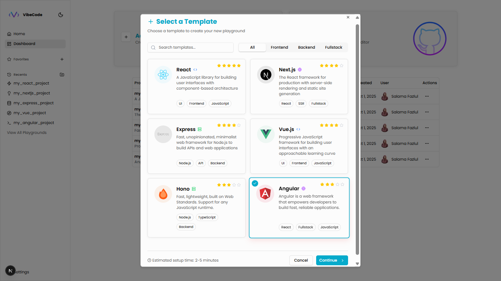

# VibeCode Studio

**VibeCode Studio** is a customizable, web-based Integrated Development Environment (IDE) built from scratch. It enables developers to write, edit, and run code in the browser with real-time editing, AI-powered suggestions, and in-browser code execution.

## Features
- **Authentication**: Sign in with Google or GitHub.
- **Landing Page**: Clean interface with light/dark mode toggle.
- **Dashboard**: Create and manage projects using templates (e.g., React, Next.js, Express, Vue).
- **Playground**: Features a file explorer, Monaco Editor for code editing, terminal, and live preview.
- **AI Assistant**: Real-time code completions and chat-based code queries via Ollama (Code Llama).
- **In-Browser Execution**: Run code with WebContainers for instant previews.

## Technologies
- **Next.js**: React framework with TypeScript.
- **Tailwind CSS & Shadcn UI**: For styling and components.
- **Monaco Editor**: Code editing.
- **WebContainers**: Browser-based Node.js runtime.
- **Ollama**: AI-powered code suggestions.
- **MongoDB & Prisma**: Database management.
- **NextAuth**: Authentication.
- **Xterm.js**: Terminal functionality.

## Getting Started

### Prerequisites
- Node.js (v18+)
- npm
- MongoDB (local or MongoDB Atlas)
- Google and GitHub OAuth credentials

### Installation
1. Clone the repository:
   ```bash
   git clone <repository-url>
   cd vibecode-studio
   ```
2. Install dependencies:
   ```bash
   npm install
   ```
3. Initialize Shadcn UI:
   ```bash
   npx shadcn@latest init
   ```
   - Select `zinc` theme and install all components: `npx shadcn@latest add --all`.
4. Set up Prisma:
   ```bash
   npx prisma init
   npx prisma generate
   npx prisma db push
   ```
5. Install WebContainer and terminal dependencies:
   ```bash
   npm install @webcontainer/api xterm xterm-addon-fit xterm-addon-web-links xterm-addon-search
   ```
6. Create a `.env` file with:
   ```env
   DATABASE_URL="your-mongodb-connection-string"
   AUTH_SECRET="your-auth-secret" # Run `npx auth secret` to generate
   AUTH_GOOGLE_ID="your-google-client-id"
   AUTH_GOOGLE_SECRET="your-google-client-secret"
   AUTH_GITHUB_ID="your-github-client-id"
   AUTH_GITHUB_SECRET="your-github-client-secret"
   ```
7. Start the development server:
   ```bash
   npm run dev
   ```

### Usage
- Access the app at `http://localhost:3000`.
- Sign in with Google or GitHub.
- Create a project from the dashboard using a template(React, Next.js, Express, Vue, Angular, ...).
- Edit code in the playground, use the terminal, and preview results live.
- Leverage AI suggestions for code completions or queries.

## Screenshots
Below are screenshots showcasing key interfaces of VibeCode Studio:

### Login Page

*Sign in using Google or GitHub for secure authentication.*

|  |  |
|:---:|:---:|
| *Home Page (Light Mode): Clean landing page with light mode.* | *Home Page (Dark Mode): Landing page with dark mode.* |

|  |  |
|:---:|:---:|
| *Dashboard (Light Mode): Manage projects with template selection.* | *Dashboard (Dark Mode): Project management in dark mode.* |

|  |  |
|:---:|:---:|
| *Template Selection: Choose from React, Next.js, Express, Vue, Hono, or Angular.* | *Project Options: Edit, duplicate, or delete projects.* |

|  |  |
|:---:|:---:|
| *Terminal Loading: View real-time logs during dependency installation.* | *Project Playground: File explorer, Monaco Editor, terminal, and live preview.* |
